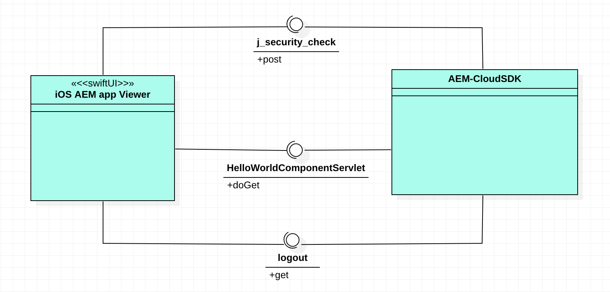

# AEM asCS author instance

This project is based on the Adobe WKND project (https://github.com/adobe/aem-guides-wknd)

Additional changes on the project base:
1) New Servlet HelloWorldComponentServlet in the core package. Get and Post (yet to be completed) methods
2) New fields and methods for the HelloWorldModel class using jackson lib to json response
3) Unit tests for the servlet and model
4) Content data

These changes were made towards having this integration with Swift iOS project

This project is using:
- AEM author asCs local instance
- Java 11